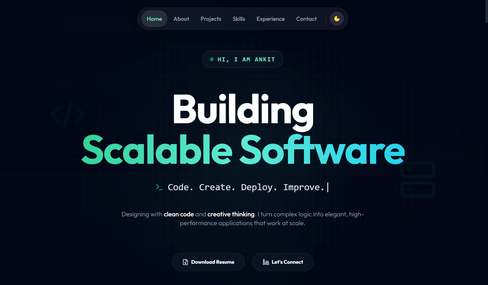

# 🚀 Ankit Developer Portfolio

A modern, responsive developer portfolio built using **React + TypeScript + Vite**, deployed on **Vercel**.

<p align="center">
  <a href="https://ankit-developer-portfolio.vercel.app/" target="_blank">
   
  </a>
</p>

---

## 🌐 Live Demo

👉 **Click here:** https://ankit-developer-portfolio.vercel.app/  
(You can also click the preview image above.)

---

## 🛠️ Tech Stack Used

### **Frontend**
<p>
  
  
  
  
  
</p>

### **Build Tool**
<p>
  
</p>

### **Deployment**
<p>
  
</p>

### **Version Control**
<p>
  
  
</p>

---

## 📂 Project Structure

```
Ankit-Developer-Portfolio/
│
├── public/
│   └── screenshots/
│       ├── Home.png
│       ├── air-quality-index-scale.jpg
│       └── quickbite-home.png
│
├── src/
│   ├── components/
│   │   ├── About.tsx
│   │   ├── Contact.tsx
│   │   ├── Experience.tsx
│   │   ├── Hero.tsx
│   │   ├── Navbar.tsx
│   │   ├── Projects.tsx
│   │   ├── Skills.tsx
│   │   │
│   │   └── ui/
│   │       └── GlassCard.tsx
│   │
│   ├── App.tsx
│   └── main.tsx
│
├── index.html
├── package.json
├── package-lock.json
├── tsconfig.json
├── vite.config.ts
├── types.ts
├── README.md
├── LICENSE
├── metadata.json
├── .gitignore
└── .env.local

```

---

## 📜 License

This project is licensed under the [MIT License](./LICENSE).

---

⭐ If you like this project, consider giving it a star!


